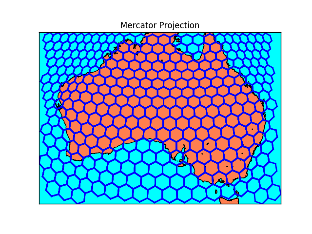

# geogrid

[](https://travis-ci.org/cortwave/geogrid)

Library for creating hex grid on sphere

## Setup

### Gradle (Jitpack dependency)
```gradle
repositories {
    ...
    maven { url "https://jitpack.io" }
}

compile 'com.github.cortwave:geogrid:0.1.0'
```

## Quick start

```java
int detalizationLevel = 12;
Grid<Hex> grid = new HexGrid(detalizationLevel);
double latitude = -35.44;
double longitude = 22.34;
GeoPoint point = new GeoPoint(latitude, longitude);
Hex hex = grid.getZoneAt(point);
List<GeoPoint> polygon = hex.getPolygon();
String zoneId = hex.getId();
```

## Hex side and square

#### Hex side


where b - hex side, d - detalization level, C - Earth meridional circumference (40 007.86 km) 


#### Hex square


where Sb - hex square, d - detalization level, Se - Earth square (510072000 km^2) 


## Examples of work

#### Detalization level 5


#### Detalization level 16 (Manhattan)


#### Detalization level 7 (Australia)



